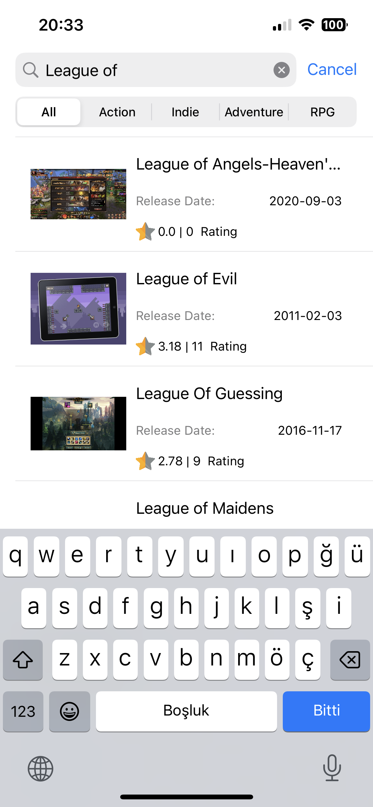

# Game Collector

### Açıklama

Game Collector güncel oyunların, bu oyunlar ile ilgili yayınlanma tarihlerinin, ratinglerinin ve oyunlar hakkındaki kısa bilgilerin bulunduğu bir uygulamadır. Bu uygulamada aynı zamanda oyunları favorilerinize ekleyebilir ve oyunlar ile ilgili notlar oluşturabilirsiniz.

### Kullanılan Kütüphaneler
<li>pod 'AlamofireImage', '~> 4.1'</li>
<li>pod 'Alamofire'</li>
<li>pod 'MaterialActivityIndicator'</li>
<li>pod 'SwiftAlertView', '~> 2.2.1'</li>

### XCODE Versiyon
<li>XCode Version 14.1</li>

### Swift Versiyon
<li>Swift 5 </li>

### Minimum iOS versiyon
<li>iOS 16.1</li>

### API
<li>https://api.rawg.io/docs</li>
<li>Belirtilen apiyi kullanabilmek için bir key' e ihtiyaç duyulmaktadır.</li>

### Görseller

  #### Game List

<table>
<tr>
<td></td>  
<td></td>  
</td>  
</tr>
</table>

<ul>
<li>Game List ekranında https://api.rawg.io/docs/  tarafından sağlanan veriler ile güncel oyunlar listelenir. </li>
<li>Oyunlar, oyun isimleri ile search kullanılarak bulunabilir.</li>
<li>Oyunlar tümü veya türlerine göre (aksiyon, macera vb.) filtrelenebilir.</li>
</ul>

<table>
<tr>
<td></td>  
</td>  
</tr>
</table>

<li>Oyunlar alfabetik sıralamaya, puanlarına ve yayınlanma tarihlerine göre sıralanabilir.</li>
<li>Oyunların search kullanılarak bulunması, sıralanması ve filtrelenmesi servis istekleri ile yapılmıştır.</li>
<li>Oyunlar seçildiğinde oyuna ait detay sayfasına ulaşılmaktadır</li>

#### Game Detail

<table>
<tr>
<td></td>  
</td>  
</tr>
</table>

    <li>Her bir oyunun detay sayfasında oyun görseli, rating bilgileri, oyunun yayınlanma tarihi ve oyun hakkında bilgiler bulunur. </li>
    <li>Detay sayfasında bulunan görselin altında favorilere seçmek için kullanılan kalp sembolü bulunmaktadır. </li>
  <li>Buton işaretlendiğinde ilgili oyun ‘’Favorites’’ ekranına kaydedilir.</li>

#### Favorites

<table>
<tr>
<td></td>  
<td></td>  
</td>  
</tr>
</table>

    <li>Oyunların detay ekranlarında favorilere ekleme yapıldıktan sonra favoriler sayfasına bu oyunlar kaydedilir ve burada listelenir.</li>
    <li>Favorilere alınan oyunlar sola kaydırılarak ‘’Delete’’ seçeneği ile favorilerden çıkarılabilir. </li>
  <li>Favoriler sayfasında da oyun seçildiğinde detay ekranına ulaşılabilir.</li>

#### Notes

<table>
<tr>
<td></td>  
<td></td>  
</td>  
</tr>
</table>

    <li>Oyunların detay ekranlarında favorilere ekleme yapıldıktan sonra favoriler sayfasına bu oyunlar kaydedilir ve burada listelenir.</li>
    <li>Favorilere alınan oyunlar sola kaydırılarak ‘’Delete’’ seçeneği ile favorilerden çıkarılabilir. </li>
  <li>Favoriler sayfasında da oyun seçildiğinde detay ekranına ulaşılabilir.</li>

<table>
<tr>
<td></td>  
<td></td>  
</td>  
</tr>
</table>

<li>Not oluşturma ekranında Game Name ve Note About Game alanları zorunlu alan olarak tasarlanmıştır.</li> 
<li>Bu başlıklardan herhangi birine ait bilgilerin doldurulmaması durumunda ekranda ‘’Error’’ uyarısı alınır.</li>

<table>
<tr>
<td></td>  
<td></td>  
<td></td>  
</td>  
</tr>
</table>

<li>Notlar kaydedildiktan sonra ekranda listelenmektedir. </li>
<li>Listede oyun adı, notun kaydedildiği tarih ve yazılan not görüntülenmektedir.</li>
<li>Aynı not içerisinde bilgiler değiştirilmek istendiğinde ilk kaydetme ekranında bulunan ‘’Add’ botunu ‘’Update’’ olarak ekranda değişmektedir. Bu buton ile kaydedilen notta değişiklik yapılabilmektedir.</li>
<li>Listede seçilen not ‘’Delete’’ butonu ile listeden çıkarılabilmektedir.</li>

#### Teşekkür
Eğitim sürecinde değerli bilgilerini bizimle paylaştığı için Kaan Yıldırım' a sonsuz teşekkür ederim.

